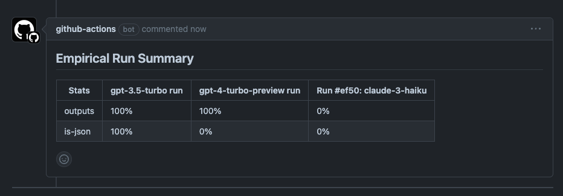

The Empirical CLI is optimized to run in CI/CD environments. This enables your team to
track model performance and quality over time.

In your CI config, trigger the Empirical CLI `run` command, after you have set up the
environment with Node.js.

```sh
npx @empiricalrun/cli run
```

## GitHub Actions

Copy-paste the following configuration file in your GitHub repo to run Empirical on
GitHub Actions.

Depending on the [models you are running](./models/basics), you need to pass environment
variables to the `run` command.

```yaml
# save in .github/workflows/empirical.yml
name: Run Empirical

on:
  pull_request:
    types: [opened, synchronize]
    # Filter to certain paths that impact LLM behavior
    # paths:
    #  - '**.js'

jobs:
  empirical-run:
    name: Run Empirical
    runs-on: ubuntu-latest
    steps:
      - name: Check out code
        uses: actions/checkout@v4
        with:
          fetch-depth: 1

      - name: Setup Node.js environment
        uses: actions/setup-node@v4
        with:
          node-version: 20

      - name: Run Empirical
        run: npx @empiricalrun/cli run
        working-directory: PATH_TO_DIR_WITH_EMPIRICAL_CONFIG # if required
        env:
          OPENAI_API_KEY: ${{ secrets.OPENAI_API_KEY }} # pass all secrets
```

### Reporting



Empirical can generate a helpful report in your GitHub pull request, when combined
with other GitHub Actions.

Use the following configuration to set this up.

```yaml
name: Run Empirical in CI

on:
  pull_request:
    types: [opened, synchronize]
    # Filter to certain paths that impact LLM behavior
    # paths:
    #  - '**.js'

jobs:
  empirical-run:
    name: Run Empirical in CI
    runs-on: ubuntu-latest
    steps:
      - name: Check out code
        uses: actions/checkout@v4
        with:
          fetch-depth: 1

      - name: Setup Node.js environment
        uses: actions/setup-node@v4
        with:
          node-version: 20

      - name: Run Empirical
        run: npx @empiricalrun/cli run
        working-directory: PATH_TO_DIR_WITH_EMPIRICAL_CONFIG # if required
        env:
          OPENAI_API_KEY: ${{ secrets.OPENAI_API_KEY }} # pass all secrets

      - name: Find Comment
        uses: peter-evans/find-comment@v3
        id: fc
        if: always()
        with:
          issue-number: ${{ github.event.pull_request.number }}
          comment-author: 'github-actions[bot]'
          body-includes: Empirical Run Summary

      - name: Create or update comment
        uses: peter-evans/create-or-update-comment@v4
        if: always()
        with:
          comment-id: ${{ steps.fc.outputs.comment-id }}
          issue-number: ${{ github.event.pull_request.number }}
          body: |
            ${{ steps.empirical-run.outputs.result }}
          edit-mode: replace
```
